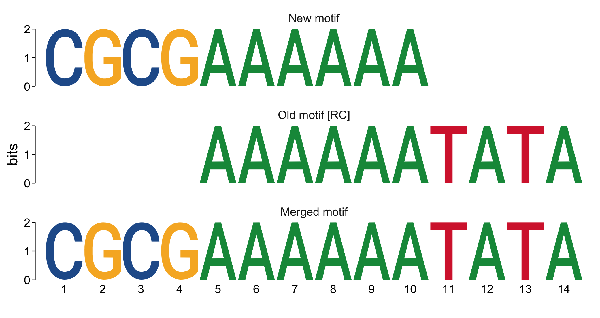

[](http://bioconductor.org/checkResults/release/bioc-LATEST/universalmotif/) [](https://www.bioconductor.org/packages/devel/bioc/html/universalmotif.html#since)
# universalmotif

This package allows for importing most common motif types into R for use by
functions provided by other Bioconductor motif-related packages. Motifs can be 
exported into most major motif formats from various classes as defined by other
Bioconductor packages. Furthermore, this package allows for easy manipulation
of motifs, such as creation, trimming, shuffling, P-value calculations,
filtering, type conversion, reverse complementation, alphabet switching, random
motif site generation, and comparison. Alongside are also included functions
for interacting with sequences, such as motif scanning and enrichment, as well
as sequence creation and shuffling functions. Finally, this package implements
higher-order motifs, allowing for more accurate sequence scanning and motif
enrichment.

## Installation

### [Bioconductor release version](https://bioconductor.org/packages/universalmotif/)

```r
if (!requireNamespace("BiocManager", quietly=TRUE))
  install.packages("BiocManager")
BiocManager::install("universalmotif")
```

### [GitHub development version](https://github.com/bjmt/universalmotif)

```r
if (!requireNamespace("BiocManager", quietly=TRUE))
  install.packages("BiocManager")
BiocManager::install("bjmt/universalmotif")
```

Note: building the vignettes when installing from source is not recommended, unless you don't mind waiting an hour for the necessary dependencies to install.

## Brief overview

All of the functions within the `universalmotif` package are fairly well documented. You can access it from within R, reading the [Bioconductor PDF](https://bioconductor.org/packages/release/bioc/manuals/universalmotif/man/universalmotif.pdf), or browsing the [rdrr.io](https://rdrr.io/bioc/universalmotif/) website. Additionally, several vignettes come with the package, which you can access from within R or on the Bioconductor website:

- [Introduction to sequence motifs](https://bioconductor.org/packages/release/bioc/vignettes/universalmotif/inst/doc/IntroductionToSequenceMotifs.pdf)
- [Motif import, export, and manipulation](https://bioconductor.org/packages/release/bioc/vignettes/universalmotif/inst/doc/MotifManipulation.pdf)
- [Sequence manipulation and scanning](https://bioconductor.org/packages/release/bioc/vignettes/universalmotif/inst/doc/SequenceSearches.pdf)
- [Motif comparisons and P-values](https://bioconductor.org/packages/release/bioc/vignettes/universalmotif/inst/doc/MotifComparisonAndPvalues.pdf)

A few key functions are also explored below.

### The `universalmotif` motif class and import/export utilities

The `universalmotif` class is used to store the motif matrix itself, as well as other basic information such as alphabet, background frequencies, strand, and various other metadata slots. There are a number of ways of getting `universalmotif` class motifs:

- Manual motif creation with `create_motif()` using one of several possible input types:
    + Consensus sequence
    + Sequence sites
    + Numeric matrix
    + No input: generate random motifs of any length

`universalmotif` class motifs are highly interoperable with other motif formats:

- Import/export from/to several supported formats:
    + `CIS-BP`: `read_cisbp()`
    + `HOMER`: `read_homer()`, `write_homer()`
    + `JASPAR`: `read_jaspar()`, `write_jaspar()`
    + `MEME`: `read_meme()`, `write_meme()`
    + `TRANSFAC`: `read_transfac()`, `write_transfac()`
    + `UNIPROBE`: `read_uniprobe()`
    + Generic matrices: `read_matrix()`, `write_matrix()`
- Conversion from/to several compatible Bioconductor package motif classes using `convert_motifs()` (some formats cannot go both ways; see the documentation for details):
    + `TFBSTools`: `PFMatrix`, `PWMatrix`, `ICMatrix`, `PFMatrixList`, `PWMatrixList`, `ICMatrixList`, `TFFMFirst`
    + `MotifDb`: `MotifList`
    + `seqLogo`: `pwm`
    + `motifStack`: `pcm`, `pfm`
    + `PWMEnrich`: `PWM`
    + `motifRG`: `Motif`
    + `Biostrings`: `PWM`
    + `rGADEM`: `motif`

```r
library(universalmotif)

create_motif()
#>
#>        Motif name:   motif
#>          Alphabet:   DNA
#>              Type:   PPM
#>           Strands:   +-
#>          Total IC:   11.46
#>         Consensus:   YGTGMMMRGA
#>
#>      Y G    T    G    M    M    M    R    G    A
#> A 0.17 0 0.00 0.04 0.58 0.62 0.29 0.47 0.08 0.77
#> C 0.36 0 0.01 0.00 0.41 0.36 0.68 0.16 0.05 0.00
#> G 0.00 1 0.03 0.95 0.00 0.00 0.04 0.28 0.86 0.23
#> T 0.47 0 0.96 0.02 0.00 0.03 0.00 0.09 0.00 0.00
```

### Sequence creation, shuffling and background calculation

An important aspect of motif scanning and enrichment is to compare the results with those from a set of random or background sequences. For this, two functions are provided:

- `create_sequences()`: create sequences of any alphabet, with optional desired background frequencies
- `shuffle_sequences()`: shuffle a set of sequences, preserving any size k-let

```r
library(universalmotif)

seqs <- create_sequences()

seqs
#>   A DNAStringSet instance of length 100
#>       width seq
#>   [1]   100 AGTACGTTCGCATGGCAGGCATTATTTGCGCTG...TATCAGCCTAGAAGCAGGCGTACCAAGGTCTA
#>   [2]   100 AATATCGGGCGCGAAGCCCGATGCGTGCTCGGA...GATGCAGTTCAAACGAAATCTCGTAAACGTGA
#>   [3]   100 AGTACAGCAATGGGGACATAAGCCGTCTCATCG...CATAGTTCTCGAAATATGAATCTCCAGTCCCA
#>   [4]   100 CAGATGCACTATCACCGTGCCGAGCTCGGTAAC...AATCGCATTGAACTAACAGGGGAGCAAGATAA
#>   [5]   100 CGGCCCCTGGGACGTTGGATCCAGATAAAGCTT...TATGTTCCTTGCCGGAATACGGCACATATCTC
#>   ...   ... ...
#>  [96]   100 CGGTGCAAAATGTGCCGCACACGGTAGTGCGGG...TTACACGCGTCTTTCGGAGAATGAGCTCGGCA
#>  [97]   100 CAGTTAATCTATTAATGAGTCACTTAGGATTCC...GTTGCTTGGATATGGGAGAGAATGGCCAGTAA
#>  [98]   100 GGGTCGTTGGCAGGGATGCACACAGACACGAAT...GTTTGCAAGACAACAGTAGCTAATTGTGCCAA
#>  [99]   100 GCCTTCGGACGCCAAGTCTGCAAACAATTCCTC...CTTCTACGCCAAAACTCTTATCCCTGGCATTC
#> [100]   100 GTCACAGCCAAGCTTTAAGTCTTCCAACCAGGA...ATTGTGGACGGAAGGTACCGTCGTAGATTCGC

seqs.shuffled <- shuffle_sequences(seqs, k = 3)
```

Additionally, if you are interested in the detailed kmer content of you sequences you can use `get_bkg()`. It can be used to calculate sequence background for any size kmer, and for any sequence alphabet. Results can be shown for individual sequences or merged together. There is also an option to calculate these results in any size windows (with any size overlap between windows) across the sequences.

```r
library(universalmotif)

data(ArabidopsisPromoters)

get_bkg(ArabidopsisPromoters, merge.res = FALSE)
#> DataFrame with 4200 rows and 4 columns
#>         sequence        klet     count probability
#>      <character> <character> <integer>   <numeric>
#> 1      AT4G28150           A       318       0.318
#> 2      AT1G19380           A       309       0.309
#> 3      AT4G19520           A       325       0.325
#> 4      AT1G03850           A       338       0.338
#> 5      AT5G01810           A       317       0.317
#> ...          ...         ...       ...         ...
#> 4196   AT5G22690         TTT        36   0.0360721
#> 4197   AT1G05670         TTT        43   0.0430862
#> 4198   AT1G06160         TTT        56   0.0561122
#> 4199   AT5G24660         TTT        43   0.0430862
#> 4200   AT3G19200         TTT        34   0.0340681

get_bkg(ArabidopsisPromoters, window = TRUE)
#> DataFrame with 840 rows and 5 columns
#>         start      stop        klet     count probability
#>     <numeric> <numeric> <character> <integer>   <numeric>
#> 1           1       100           A      1604      0.3208
#> 2         101       200           A      1636      0.3272
#> 3         201       300           A      1773      0.3546
#> 4         301       400           A      1791      0.3582
#> 5         401       500           A      1716      0.3432
#> ...       ...       ...         ...       ...         ...
#> 836       501       600         TTT       255   0.0520408
#> 837       601       700         TTT       269   0.0548980
#> 838       701       800         TTT       233   0.0475510
#> 839       801       900         TTT       255   0.0520408
#> 840       901      1000         TTT       271   0.0553061
```

### Sequence scanning and higher order motifs

The `universalmotif` package provides the `scan_sequences()` function to quickly scan a set of input sequences for motif hits. Additionally, the `add_multifreq()` function can be used to generate higher order motifs. These can also be used to scan sequences with higher accuracy.

```r
library(universalmotif)
library(Biostrings)
data(ArabidopsisPromoters)

seqs <- DNAStringSet(rep(c("CAAAACC", "CTTTTCC"), 3))
motif <- create_motif(seqs, pseudocount = 1)

scan_sequences(motif, ArabidopsisPromoters, threshold = 0.9,
    threshold.type = "logodds")
#> DataFrame with 53 rows and 12 columns
#>           motif   motif.i    sequence     start      stop     score       match
#>     <character> <integer> <character> <integer> <integer> <numeric> <character>
#> 1         motif         1   AT4G28150       621       627      9.08     CTAAACC
#> 2         motif         1   AT1G19380       139       145      9.08     CTTATCC
#> 3         motif         1   AT1G19380       204       210      9.08     CTAAACC
#> 4         motif         1   AT1G03850       203       209      9.08     CTAATCC
#> 5         motif         1   AT5G01810       821       827      9.08     CATATCC
#> ...         ...       ...         ...       ...       ...       ...         ...
#> 49        motif         1   AT1G19510       960       966      9.08     CTTTTCC
#> 50        motif         1   AT5G22690        81        87      9.08     CAATACC
#> 51        motif         1   AT5G22690       362       368      9.08     CAAATCC
#> 52        motif         1   AT1G06160       956       962      9.08     CTAATCC
#> 53        motif         1   AT3G19200       365       371      9.08     CATTACC
#>     thresh.score min.score max.score score.pct      strand
#>        <numeric> <numeric> <numeric> <numeric> <character>
#> 1          8.172   -19.649      9.08       100           +
#> 2          8.172   -19.649      9.08       100           +
#> 3          8.172   -19.649      9.08       100           +
#> 4          8.172   -19.649      9.08       100           +
#> 5          8.172   -19.649      9.08       100           +
#> ...          ...       ...       ...       ...         ...
#> 49         8.172   -19.649      9.08       100           +
#> 50         8.172   -19.649      9.08       100           +
#> 51         8.172   -19.649      9.08       100           +
#> 52         8.172   -19.649      9.08       100           +
#> 53         8.172   -19.649      9.08       100           +

motif.k2 <- add_multifreq(motif, seqs, add.k = 2)
scan_sequences(motif.k2, ArabidopsisPromoters, use.freq = 2, threshold = 0.9,
    threshold.type = "logodds")
#> DataFrame with 8 rows and 12 columns
#>         motif   motif.i    sequence     start      stop     score       match
#>   <character> <integer> <character> <integer> <integer> <numeric> <character>
#> 1       motif         1   AT4G12690       938       943    17.827      CAAAAC
#> 2       motif         1   AT2G37950       751       756    17.827      CAAAAC
#> 3       motif         1   AT1G49840       959       964    17.827      CTTTTC
#> 4       motif         1   AT1G77210       184       189    17.827      CAAAAC
#> 5       motif         1   AT1G77210       954       959    17.827      CAAAAC
#> 6       motif         1   AT3G57640       917       922    17.827      CTTTTC
#> 7       motif         1   AT4G14365       977       982    17.827      CTTTTC
#> 8       motif         1   AT1G19510       960       965    17.827      CTTTTC
#>   thresh.score min.score max.score score.pct      strand
#>      <numeric> <numeric> <numeric> <numeric> <character>
#> 1      16.0443   -16.842    17.827       100           +
#> 2      16.0443   -16.842    17.827       100           +
#> 3      16.0443   -16.842    17.827       100           +
#> 4      16.0443   -16.842    17.827       100           +
#> 5      16.0443   -16.842    17.827       100           +
#> 6      16.0443   -16.842    17.827       100           +
#> 7      16.0443   -16.842    17.827       100           +
#> 8      16.0443   -16.842    17.827       100           +
```

### Motif comparison, merging and viewing

A commonly performed task after _de novo_ motif discovery is to check how closely it might resemble known motifs. This can be performed using the highly customizable `compare_motifs()` with one of several available metrics. Different motifs can also be merged with `merge_motifs()`.

```r
library(universalmotif)

new.motif <- create_motif("CGCGAAAAAA", name = "New motif")
old.motif <- create_motif("TATATTTTTT", name = "Old motif")

compare_motifs(c(new.motif, old.motif), method = "PCC", min.overlap = 5)[2]
#> [1] 1
compare_motifs(c(new.motif, old.motif), method = "PCC", min.overlap = 10)[2]
#> [1] 0.2

merged.motif <- merge_motifs(c(new.motif, old.motif), method = "PCC",
    new.name = "Merged motif")

view_motifs(c(new.motif, old.motif, merged.motif))
```



