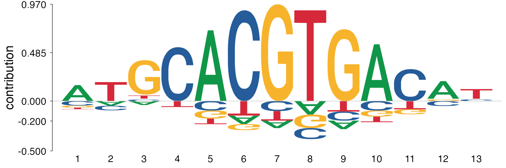
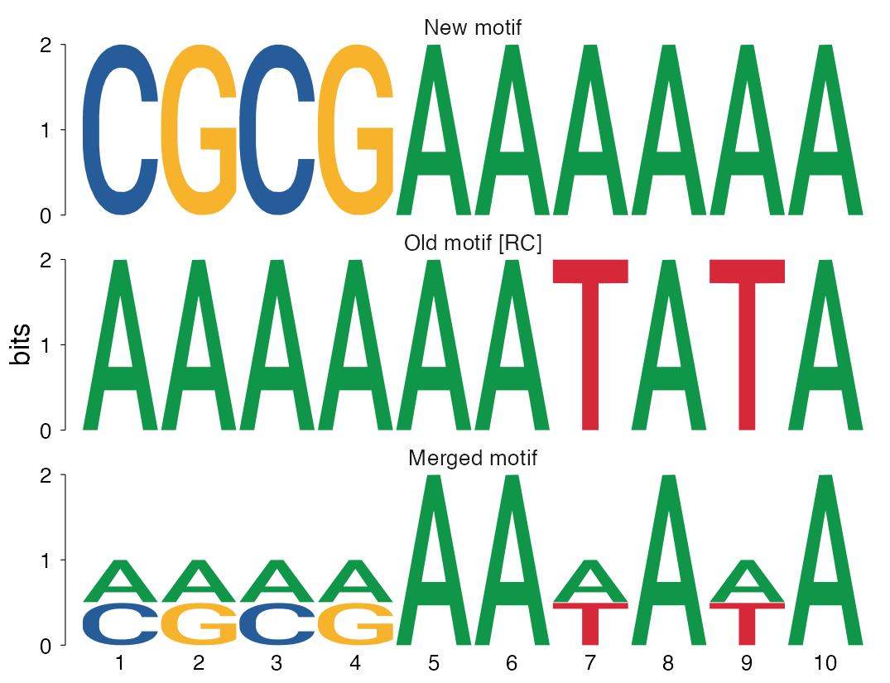
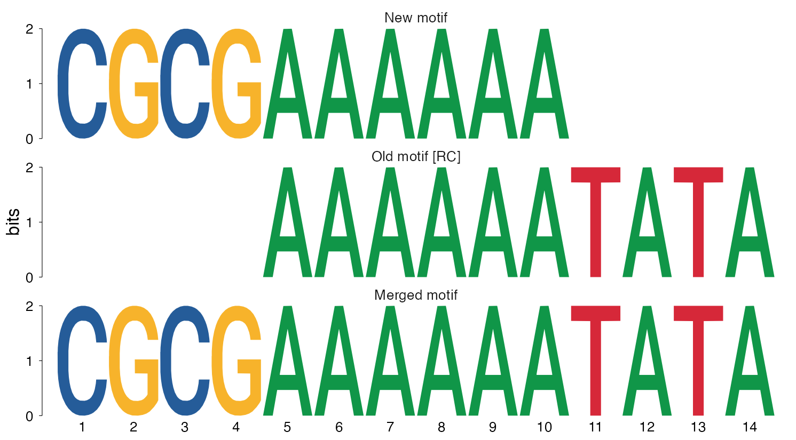

[](http://bioconductor.org/checkResults/release/bioc-LATEST/universalmotif/) [](https://www.bioconductor.org/packages/devel/bioc/html/universalmotif.html#since) [](https://doi.org/10.21105/joss.07012)
# universalmotif

This package allows for importing most common motif types into R for use by
functions provided by other Bioconductor motif-related packages. Motifs can be 
exported into most major motif formats from various classes as defined by other
Bioconductor packages. Furthermore, this package allows for easy manipulation
of motifs, such as creation, trimming, shuffling, P-value calculations,
filtering, type conversion, reverse complementation, alphabet switching, random
motif site generation, and comparison. Contribution weight matrices (CWMs) from
deep learning methods are supported as a motif type alongside the probabilistic
representations. Alongside are also included
functions for interacting with sequences, such as motif scanning and enrichment,
_de novo_ motif discovery, and motif co-occurrence testing, as well as sequence
creation and shuffling functions. For DNA and RNA motifs, faster
Pearson-correlation implementations of motif comparison and sequence scanning
are also available. Finally, this package implements higher-order motifs,
allowing for more accurate sequence scanning and motif enrichment.

## Installation

### [Bioconductor release version](https://bioconductor.org/packages/universalmotif/)

```r
if (!requireNamespace("BiocManager", quietly=TRUE))
  install.packages("BiocManager")
BiocManager::install("universalmotif")
```

### [GitHub development version](https://github.com/bjmt/universalmotif)

```r
if (!requireNamespace("BiocManager", quietly=TRUE))
  install.packages("BiocManager")
BiocManager::install("bjmt/universalmotif")
```

Note: building the vignettes when installing from source is not recommended, unless you don't mind waiting an hour for the necessary dependencies to install.

### Error when installing from source

If you trying to install the package from source and are getting compiler errors similar to these issues [[1](https://github.com/bjmt/universalmotif/issues/3), [2](https://github.com/bjmt/universalmotif/issues/16), [3](https://github.com/tnagler/RcppThread/issues/13)], then update your C++ compiler. This is an issue regarding incompatibilities between older compilers and the C++11 lambda functions from the [RcppThread](https://github.com/tnagler/RcppThread) package, which is used by the `universalmotif` package.

## Citation

If the `universalmotif` package has been useful for your research, please cite the following article:

Tremblay BJM (2024). universalmotif: An R package for biological motif analysis. _Journal of Open Source Software_ **9**, 7012. DOI:[10.21105/joss.07012](https://doi.org/10.21105/joss.07012)

## Brief overview

All of the functions within the `universalmotif` package are fairly well documented. You can access the documentation from within R, reading the [Bioconductor PDF](https://bioconductor.org/packages/release/bioc/manuals/universalmotif/man/universalmotif.pdf), or browsing the [rdrr.io](https://rdrr.io/bioc/universalmotif/) website (the latter is not always up to date). Additionally, several vignettes come with the package, which you can access from within R or on the Bioconductor website:

- [Introduction to sequence motifs](https://bioconductor.org/packages/release/bioc/vignettes/universalmotif/inst/doc/IntroductionToSequenceMotifs.pdf)
- [Motif import, export, and manipulation](https://bioconductor.org/packages/release/bioc/vignettes/universalmotif/inst/doc/MotifManipulation.pdf)
- [Sequence manipulation and scanning](https://bioconductor.org/packages/release/bioc/vignettes/universalmotif/inst/doc/SequenceSearches.pdf)
- [Motif comparisons and P-values](https://bioconductor.org/packages/release/bioc/vignettes/universalmotif/inst/doc/MotifComparisonAndPvalues.pdf)
- [An end-to-end ChIP-seq workflow](https://bioconductor.org/packages/release/bioc/vignettes/universalmotif/inst/doc/ChIPseqWorkflow.pdf)
- [Building a curated motif database](https://bioconductor.org/packages/release/bioc/vignettes/universalmotif/inst/doc/MotifDatabaseCuration.pdf)

You can also look through the slides of my [Bioc2021 presentation](https://f1000research.com/slides/10-715), which goes over some basics of motif representations, scanning, and motif comparison.

A few key functions are also explored below.

### The `universalmotif` motif class and import/export utilities

The `universalmotif` class is used to store the motif matrix itself, as well as other basic information such as alphabet, background frequencies, strand, and various other metadata slots. There are a number of ways of getting `universalmotif` class motifs:

- Manual motif creation with `create_motif()` using one of several possible input types:
    + Consensus sequence
    + Sequence sites
    + Numeric matrix
    + No input: generate random motifs of any length

`universalmotif` class motifs are highly interoperable with other motif formats:

- Import/export from/to several supported formats:
    + `CIS-BP`: `read_cisbp()`
    + `HOMER`: `read_homer()`, `write_homer()`
    + `JASPAR`: `read_jaspar()`, `write_jaspar()`
    + `MEME`: `read_meme()`, `write_meme()`
    + `TRANSFAC`: `read_transfac()`, `write_transfac()`
    + `UNIPROBE`: `read_uniprobe()`
    + Generic matrices: `read_matrix()`, `write_matrix()`
- Conversion from/to several compatible Bioconductor package motif classes using `convert_motifs()` (some formats cannot go both ways; see the documentation for details):
    + `TFBSTools`: `PFMatrix`, `PWMatrix`, `ICMatrix`, `PFMatrixList`, `PWMatrixList`, `ICMatrixList`, `TFFMFirst`
    + `MotifDb`: `MotifList`
    + `seqLogo`: `pwm`
    + `motifStack`: `pcm`, `pfm`
    + `PWMEnrich`: `PWM`
    + `motifRG`: `Motif`
    + `Biostrings`: `PWM`
    + `rGADEM`: `motif`

```r
library(universalmotif)

create_motif()
#>
#>        Motif name:   motif
#>          Alphabet:   DNA
#>              Type:   PPM
#>           Strands:   +-
#>          Total IC:   11.46
#>         Consensus:   YGTGMMMRGA
#>
#>      Y G    T    G    M    M    M    R    G    A
#> A 0.17 0 0.00 0.04 0.58 0.62 0.29 0.47 0.08 0.77
#> C 0.36 0 0.01 0.00 0.41 0.36 0.68 0.16 0.05 0.00
#> G 0.00 1 0.03 0.95 0.00 0.00 0.04 0.28 0.86 0.23
#> T 0.47 0 0.96 0.02 0.00 0.03 0.00 0.09 0.00 0.00
```

See `?universalmotif` for a list of available metadata slots. Most slots can be accessed using square brackets, e.g. `MotifObject["motif"]` accesses the raw numeric matrix. You can also dump the contents of all accessible motif slots at once into a list, e.g. `MotifObject[]`.

The `universalmotif` class supports five motif types: the four probabilistic representations `PCM`, `PPM`, `PWM` and `ICM`, plus `CWM` (contribution weight matrix). A CWM holds signed, unnormalised per-position, per-letter contribution scores of the kind produced by deep learning methods, and so (unlike the probabilistic types) it carries no column-sum constraint. CWMs can be created directly, read from and written to MEME and generic-matrix files, converted to a PPM, and trimmed by contribution:

```r
library(universalmotif)

m <- matrix(c(
   0.16, -0.05, -0.04,  0.00,  0.71, -0.09, -0.08, -0.14, -0.09,  0.57, -0.01,  0.18, -0.01,  # A
  -0.05, -0.05,  0.02,  0.54, -0.10,  0.91, -0.11, -0.12, -0.10, -0.10,  0.32, -0.04,  0.02,  # C
  -0.03,  0.00,  0.35, -0.01, -0.09, -0.07,  0.97, -0.14,  0.72, -0.07, -0.05,  0.02, -0.02,  # G
  -0.02,  0.19,  0.04, -0.05, -0.06, -0.15, -0.10,  0.91, -0.11, -0.06, -0.08, -0.01,  0.10), # T
  nrow = 4, byrow = TRUE,
  dimnames = list(c("A", "C", "G", "T"), NULL))

cwm <- create_motif(m, type = "CWM", name = "attribution_motif")

convert_type(cwm, "PPM")  # |cwm| / colSums(|cwm|), per column

view_motifs(cwm, use.type = "CWM", flip.neg = TRUE)  # contribution logo, negatives flipped
```



`read_meme()` and `write_meme()` take a `CWM = TRUE` flag to read or write CWM matrices, `read_matrix()` and `write_matrix()` round-trip them via `type = "CWM"`, and `trim_cwm()` trims low-contribution flanking columns by absolute column sum.

### Sequence creation, shuffling and background calculation

An important aspect of motif scanning and enrichment is to compare the results with those from a set of random or background sequences. For this, two functions are provided:

- `create_sequences()`: create sequences of any alphabet, with optional desired background frequencies
- `shuffle_sequences()`: shuffle a set of sequences, preserving any size k-let

```r
library(universalmotif)

seqs <- create_sequences()

seqs
#>   A DNAStringSet instance of length 100
#>       width seq
#>   [1]   100 AGTACGTTCGCATGGCAGGCATTATTTGCGCTG...TATCAGCCTAGAAGCAGGCGTACCAAGGTCTA
#>   [2]   100 AATATCGGGCGCGAAGCCCGATGCGTGCTCGGA...GATGCAGTTCAAACGAAATCTCGTAAACGTGA
#>   [3]   100 AGTACAGCAATGGGGACATAAGCCGTCTCATCG...CATAGTTCTCGAAATATGAATCTCCAGTCCCA
#>   [4]   100 CAGATGCACTATCACCGTGCCGAGCTCGGTAAC...AATCGCATTGAACTAACAGGGGAGCAAGATAA
#>   [5]   100 CGGCCCCTGGGACGTTGGATCCAGATAAAGCTT...TATGTTCCTTGCCGGAATACGGCACATATCTC
#>   ...   ... ...
#>  [96]   100 CGGTGCAAAATGTGCCGCACACGGTAGTGCGGG...TTACACGCGTCTTTCGGAGAATGAGCTCGGCA
#>  [97]   100 CAGTTAATCTATTAATGAGTCACTTAGGATTCC...GTTGCTTGGATATGGGAGAGAATGGCCAGTAA
#>  [98]   100 GGGTCGTTGGCAGGGATGCACACAGACACGAAT...GTTTGCAAGACAACAGTAGCTAATTGTGCCAA
#>  [99]   100 GCCTTCGGACGCCAAGTCTGCAAACAATTCCTC...CTTCTACGCCAAAACTCTTATCCCTGGCATTC
#> [100]   100 GTCACAGCCAAGCTTTAAGTCTTCCAACCAGGA...ATTGTGGACGGAAGGTACCGTCGTAGATTCGC

seqs.shuffled <- shuffle_sequences(seqs, k = 3)
```

Additionally, if you are interested in the detailed k-mer content of you sequences you can use `get_bkg()`. It can be used to calculate sequence background for any size k-mer, and for any sequence alphabet. Results can be shown for individual sequences or merged together. There is also an option to calculate these results in any size windows (with any size overlap between windows) across the sequences.

```r
library(universalmotif)

data(ArabidopsisPromoters)

get_bkg(ArabidopsisPromoters, merge.res = FALSE)
#> DataFrame with 4200 rows and 4 columns
#>         sequence        klet     count probability
#>      <character> <character> <integer>   <numeric>
#> 1      AT4G28150           A       318       0.318
#> 2      AT1G19380           A       309       0.309
#> 3      AT4G19520           A       325       0.325
#> 4      AT1G03850           A       338       0.338
#> 5      AT5G01810           A       317       0.317
#> ...          ...         ...       ...         ...
#> 4196   AT5G22690         TTT        36   0.0360721
#> 4197   AT1G05670         TTT        43   0.0430862
#> 4198   AT1G06160         TTT        56   0.0561122
#> 4199   AT5G24660         TTT        43   0.0430862
#> 4200   AT3G19200         TTT        34   0.0340681

get_bkg(ArabidopsisPromoters, window = TRUE)
#> DataFrame with 840 rows and 5 columns
#>         start      stop        klet     count probability
#>     <numeric> <numeric> <character> <integer>   <numeric>
#> 1           1       100           A      1604      0.3208
#> 2         101       200           A      1636      0.3272
#> 3         201       300           A      1773      0.3546
#> 4         301       400           A      1791      0.3582
#> 5         401       500           A      1716      0.3432
#> ...       ...       ...         ...       ...         ...
#> 836       501       600         TTT       255   0.0520408
#> 837       601       700         TTT       269   0.0548980
#> 838       701       800         TTT       233   0.0475510
#> 839       801       900         TTT       255   0.0520408
#> 840       901      1000         TTT       271   0.0553061
```

A few further sequence utilities are provided as well: `match_bkg()` and `plot_match_bkg()` sample composition-matched background sequences from a larger universe, `mask_ranges()` and `mask_seqs()` mask regions of sequences (for example low-complexity or repeat regions) before scanning, and `implant_motifs()` plants known motif instances at known positions (useful for building a labelled answer key against which to test discovery and scanning pipelines).

### Sequence scanning and higher order motifs

The `universalmotif` package provides the `scan_sequences()` function to quickly scan a set of input sequences for motif hits. Additionally, the `add_multifreq()` function can be used to generate higher order motifs. These can also be used to scan sequences with higher accuracy. By default `scan_sequences()` calculates a threshold cutoff from a P-value, though this can be changed to a manual logodds threshold.

```r
library(universalmotif)
library(Biostrings)
data(ArabidopsisPromoters)

seqs <- DNAStringSet(rep(c("CAAAACC", "CTTTTCC"), 3))
motif <- create_motif(seqs, pseudocount = 1)

scan_sequences(motif, ArabidopsisPromoters)
#> DataFrame with 53 rows and 14 columns
#>           motif   motif.i    sequence     start      stop     score       match
#>     <character> <integer> <character> <integer> <integer> <numeric> <character>
#> 1         motif         1   AT1G03850       203       209      9.08     CTAATCC
#> 2         motif         1   AT1G06160       956       962      9.08     CTAATCC
#> 3         motif         1   AT1G07490       472       478      9.08     CTTAACC
#> 4         motif         1   AT1G07490       936       942      9.08     CATTTCC
#> 5         motif         1   AT1G19380       139       145      9.08     CTTATCC
#> ...         ...       ...         ...       ...       ...       ...         ...
#> 49        motif         1   AT5G20200       430       436      9.08     CAATTCC
#> 50        motif         1   AT5G22690        81        87      9.08     CAATACC
#> 51        motif         1   AT5G22690       362       368      9.08     CAAATCC
#> 52        motif         1   AT5G58430       332       338      9.08     CATAACC
#> 53        motif         1   AT5G58430       343       349      9.08     CAAATCC
#>     thresh.score min.score max.score score.pct      strand      pvalue    qvalue
#>        <numeric> <numeric> <numeric> <numeric> <character>   <numeric> <numeric>
#> 1           9.08   -19.649      9.08       100           + 0.000976562  0.915758
#> 2           9.08   -19.649      9.08       100           + 0.000976562  0.915758
#> 3           9.08   -19.649      9.08       100           + 0.000976562  0.915758
#> 4           9.08   -19.649      9.08       100           + 0.000976562  0.915758
#> 5           9.08   -19.649      9.08       100           + 0.000976562  0.915758
#> ...          ...       ...       ...       ...         ...         ...       ...
#> 49          9.08   -19.649      9.08       100           + 0.000976562  0.915758
#> 50          9.08   -19.649      9.08       100           + 0.000976562  0.915758
#> 51          9.08   -19.649      9.08       100           + 0.000976562  0.915758
#> 52          9.08   -19.649      9.08       100           + 0.000976562  0.915758
#> 53          9.08   -19.649      9.08       100           + 0.000976562  0.915758

motif.k2 <- add_multifreq(motif, seqs, add.k = 2)
scan_sequences(motif.k2, ArabidopsisPromoters, use.freq = 2, threshold = 1e-6)
#> DataFrame with 8 rows and 14 columns
#>         motif   motif.i    sequence     start      stop     score       match
#>   <character> <integer> <character> <integer> <integer> <numeric> <character>
#> 1       motif         1   AT1G19510       960       965    17.827      CTTTTC
#> 2       motif         1   AT1G49840       959       964    17.827      CTTTTC
#> 3       motif         1   AT1G77210       184       189    17.827      CAAAAC
#> 4       motif         1   AT1G77210       954       959    17.827      CAAAAC
#> 5       motif         1   AT2G37950       751       756    17.827      CAAAAC
#> 6       motif         1   AT3G57640       917       922    17.827      CTTTTC
#> 7       motif         1   AT4G12690       938       943    17.827      CAAAAC
#> 8       motif         1   AT4G14365       977       982    17.827      CTTTTC
#>   thresh.score min.score max.score score.pct      strand      pvalue    qvalue
#>      <numeric> <numeric> <numeric> <numeric> <character>   <numeric> <numeric>
#> 1       17.827   -16.842    17.827       100           + 1.90735e-06 0.0118494
#> 2       17.827   -16.842    17.827       100           + 1.90735e-06 0.0118494
#> 3       17.827   -16.842    17.827       100           + 1.90735e-06 0.0118494
#> 4       17.827   -16.842    17.827       100           + 1.90735e-06 0.0118494
#> 5       17.827   -16.842    17.827       100           + 1.90735e-06 0.0118494
#> 6       17.827   -16.842    17.827       100           + 1.90735e-06 0.0118494
#> 7       17.827   -16.842    17.827       100           + 1.90735e-06 0.0118494
#> 8       17.827   -16.842    17.827       100           + 1.90735e-06 0.0118494
```

Note the differences between the matching sequences of regular scanning versus higher order scanning.

For DNA and RNA, `scan_sequences_lite()` offers a faster scanner that reuses the same C++ core as `scan_sequences()` with a streamlined set of options. Beyond scanning known motifs, `motif_finder()` discovers motifs _de novo_ directly from a set of sequences, and `motif_coocc()` tests for significantly co-occurring motif pairs.

### Motif comparison, merging and viewing

A commonly performed task after _de novo_ motif discovery is to check how closely it might resemble known motifs. This can be performed using the highly customizable `compare_motifs()` with one of several available metrics. Different motifs can also be merged with `merge_motifs()`, and `view_motifs()` can be used to examine the top-scoring alignment chosen by either. For DNA and RNA motifs, `compare_motifs_lite()`, `merge_motifs_lite()` and `view_motifs_lite()` provide faster alternatives built on a Pearson-correlation backend, while `motif_tree_lite()` turns a `compare_motifs_lite()` score matrix into a distance tree. The example below uses these faster functions; the originals behave equivalently and also handle amino-acid and custom alphabets.

```r
library(universalmotif)

new.motif <- create_motif("CGCGAAAAAA", name = "New motif")
old.motif <- create_motif("TATATTTTTT", name = "Old motif")
```

Using very strict alignment parameters, such as no overhangs:

```r
compare_motifs_lite(c(new.motif, old.motif), min.overlap = 10)[1, 2]
#> [1] 0.2

merged.motif <- merge_motifs_lite(c(new.motif, old.motif),
    new.name = "Merged motif", min.overlap = 10)

view_motifs_lite(c(new.motif, old.motif, merged.motif), min.overlap = 10)
```



After relaxing the alignment parameters:

```r
compare_motifs_lite(c(new.motif, old.motif), min.overlap = 5)[1, 2]
#> [1] 1

merged.motif <- merge_motifs_lite(c(new.motif, old.motif),
    new.name = "Merged motif", min.overlap = 5)

view_motifs_lite(c(new.motif, old.motif, merged.motif), min.overlap = 5)
```



Like `compare_motifs()`, `compare_motifs_lite()` returns a numeric matrix by default, meaning the output from comparisons between large numbers of motifs can be easily used to generate heatmaps or dendrograms.
